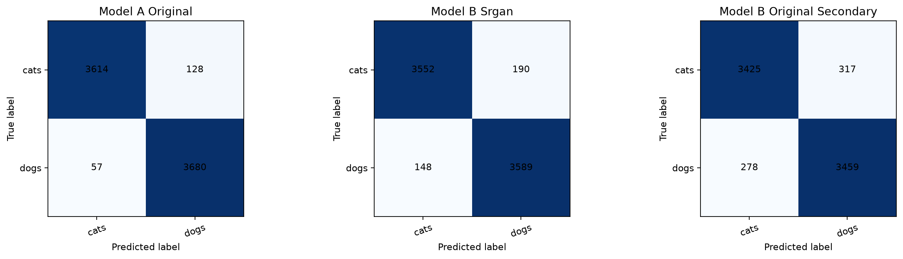
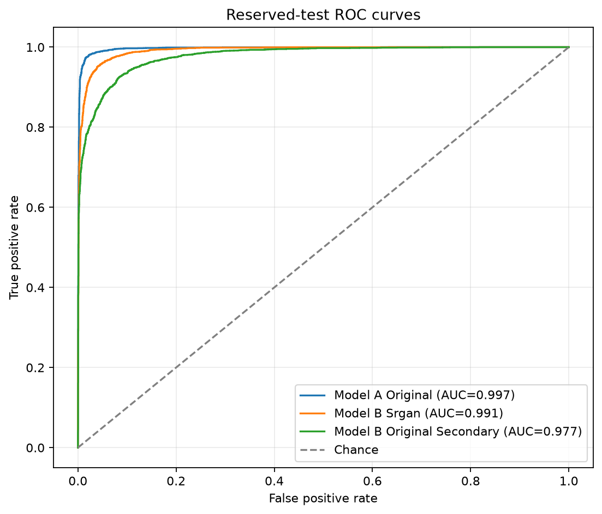

# Applied AI Midterm: SRGAN-Assisted Binary Classification

## Project objective

This PyTorch project measures whether GAN-based super-resolution changes binary
image-classification performance. It compares two transfer-learning classifiers
on the same cats-versus-dogs task:

- **Model A** is trained on original images resized to 128 × 128.
- **Model B** uses the same classifier architecture and training policy, but is
  trained on 128 × 128 images generated by an SRGAN from 32 × 32 inputs.

The completed experiment evaluates both best checkpoints on the identical
reserved test records. Model B's primary test input is generated by the frozen
SRGAN; Model B on directly resized originals is an optional secondary analysis.

## Current evidence status

The complete data, training, generation, and evaluation pipelines were run on
the local cats-versus-dogs dataset. The repository includes lightweight output
artifacts: training histories, aligned test predictions, machine-readable
metrics, confusion matrices, and ROC curves. The raw and generated datasets
and binary checkpoints remain excluded from Git because of their size.

The saved run completed 20 epochs for each classifier and 150 SRGAN epochs,
with SRGAN checkpoints produced every five epochs. The final evaluation covers
all 7,479 reserved test records.

## Dataset

### Source

The working dataset was supplied to this project from a folder named
`dogs-vs-cats-classification`. Its exact publisher and download URL are not
recorded in the repository, so this documentation does not infer or fabricate
one. Record the original download page here before final submission if source
attribution is required by the course.

Raw image files remain under `data/raw/` and are ignored by Git. The supported
layouts are:

```text
data/raw/<class name>/...
```

or:

```text
data/raw/train/<class name>/...
```

Exactly two class directories are required. JPG, JPEG, PNG, and WEBP files are
discovered recursively.

### Verified class and split counts

The current local dataset contains 24,930 readable manifest-referenced images:

| Class | Label | Full dataset | Training split | Test split |
|---|---:|---:|---:|---:|
| cats | 0 | 12,472 | 8,730 | 3,742 |
| dogs | 1 | 12,458 | 8,721 | 3,737 |
| **Total** |  | **24,930** | **17,451** | **7,479** |

The manifests contain no duplicated paths, no missing files, and no train/test
overlap in the audited checkout.

## Reproducible split and leakage prevention

`scripts/prepare_data.py` discovers the original images and calls a single
stratified split with:

- training ratio: 0.70;
- test ratio: 0.30;
- stratification target: binary label;
- random seed: 42; and
- implementation: `sklearn.model_selection.train_test_split`.

The results are persisted in:

```text
data/splits/train.csv
data/splits/test.csv
```

Each manifest contains `filepath`, `class_name`, and `label`. Paths are relative
to `data/raw`, making them portable across local checkouts.
Existing paired manifests are reused unless replacement is explicitly forced.

The following rules prevent leakage:

1. Model A training, its validation subset, and SRGAN training read only
   `data/splits/train.csv`.
2. The reproducible development validation subset is stratified from the
   training manifest with seed 42 and a 0.20 validation ratio.
3. `data/splits/test.csv` is not used for training, validation, early stopping,
   SRGAN optimization, Model B image generation, or model selection.
4. Model B generation requires every `source_filepath` to belong to the
   canonical training manifest.
5. Model B applies the same source-record development partition as Model A, so
   generated forms of one source cannot appear in both training and validation.
6. Test images are passed through the completed, frozen generator only during
   final evaluation. The generator is in evaluation mode under PyTorch
   inference mode and receives no optimizer update.
7. Models A and B are evaluated over one sorted test-record stream, with
   filepath and label alignment checked before reports are saved.

## Repository layout

```text
AGENTS.md                         Project rules and experimental contract
configs/config.yaml               Shared reproducibility configuration
data/
  raw/                            Original images; ignored by Git
  splits/train.csv                Persisted 70% training records
  splits/test.csv                 Persisted 30% reserved test records
  generated/                      Model B generated images; ignored by Git
notebooks/
  01_data_preparation.ipynb       Split audit and transformation examples
  02_classifier_a.ipynb           Model A training and resume workflow
  03_srgan_training.ipynb         SRGAN training and progress comparisons
  04_generate_srgan_images.ipynb  Resumable Model B image generation
  05_classifier_b.ipynb           Model B training and resume workflow
  06_model_comparison.ipynb       Final aligned reserved-test evaluation
scripts/
  prepare_data.py                 Create or verify persisted manifests
  generate_model_b.py             Generate Model B training images
src/applied_ai_midterm/           Reusable models, data, training, and reports
tests/                             Synthetic no-download automated tests
artifacts/checkpoints/             Local checkpoints; ignored by Git
reports/metrics/                   JSON/CSV evaluation outputs
reports/figures/                   Final confusion matrices and ROC curves
```

## Installation

Python 3.12 is required.

### macOS or Linux

```bash
python3.12 -m venv .venv
source .venv/bin/activate
python -m pip install --upgrade pip
python -m pip install -e '.[notebooks,dev]'
pytest
ruff check .
```

### Windows PowerShell

```powershell
py -3.12 -m venv .venv
.\.venv\Scripts\Activate.ps1
python -m pip install --upgrade pip
python -m pip install -e ".[notebooks,dev]"
pytest
ruff check .
```

The flat requirements file can alternatively install the notebook environment:

```bash
python -m pip install -r requirements.txt
python -m pip install -e .
```

## Shared configuration

The versioned defaults in `configs/config.yaml` are:

| Setting | Value |
|---|---:|
| random seed | 42 |
| train/test ratio | 0.70 / 0.30 |
| low/high resolution | 32 / 128 |
| classifier batch size | 32 |
| SRGAN batch size | 16 |
| classifier epochs | 20 |
| SRGAN epochs | 150 |
| SRGAN checkpoint interval | 5 epochs |
| data-loader workers | 2 |

Python, NumPy, PyTorch CPU, and available CUDA generators are seeded. CuDNN
benchmarking is disabled and deterministic behavior is requested. DataLoader
workers derive their seeds from the saved PyTorch generator state.

## Model A

Model A uses torchvision MobileNetV2 initialized with
`MobileNet_V2_Weights.DEFAULT`. The existing classifier layer is replaced by a
linear layer with exactly one output logit. Training uses raw logits with
`BCEWithLogitsLoss`; sigmoid is applied only when probabilities are needed.

Deterministic validation and test preprocessing resizes RGB images to
128 × 128 with bicubic interpolation, converts them to tensors, and applies
ImageNet normalization:

```text
mean = (0.485, 0.456, 0.406)
std  = (0.229, 0.224, 0.225)
```

Training augmentation uses random resized crop, horizontal flip, rotation up
to 10 degrees, and moderate color jitter before ImageNet normalization.

| Model A hyperparameter | Value |
|---|---:|
| epochs | 20 |
| batch size | 32 |
| optimizer | AdamW |
| learning rate | 0.0001 |
| weight decay | 0.0001 |
| scheduler | StepLR, step size 7, gamma 0.1 |
| validation ratio | 0.20 of training manifest |
| best-model criterion | validation F1 |

## SRGAN architecture

### Generator

The generator accepts normalized 32 × 32 RGB tensors and returns 128 × 128 RGB
tensors in `[-1, 1]`:

1. 9 × 9 entry convolution with 64 channels and PReLU.
2. Sixteen residual blocks. Each block contains two 3 × 3 convolutions,
   batch normalization, PReLU after the first convolution, and a local skip.
3. A 3 × 3 post-residual convolution and batch normalization.
4. A global skip connection from entry features.
5. Two upsampling blocks, each using a 3 × 3 convolution, 2× PixelShuffle,
   and PReLU. Together they enlarge 32 × 32 to 128 × 128.
6. A 9 × 9 RGB output convolution followed by `tanh`.

### Discriminator

The discriminator receives real or generated 128 × 128 tensors and returns one
unbounded real/fake logit without a final sigmoid. Eight convolutional blocks
progress from 64 to 512 channels, alternating stride 1 and stride 2. Blocks use
3 × 3 convolutions, batch normalization except on the first block, and
LeakyReLU with slope 0.2. Adaptive average pooling and a final linear layer
produce the logit.

### Loss and optimization

The generator objective is:

```text
L_G = 1.0 * L1(generated, target)
    + 0.001 * BCEWithLogits(D(generated), real)
    + 0.0 * L1(VGG(generated), VGG(target))
```

Thus the configured run uses pixel/content L1 loss and adversarial logit loss;
optional frozen VGG19 perceptual loss is implemented but disabled by its zero
weight. The discriminator uses `BCEWithLogitsLoss` on real and fake logits.

Both networks use Adam with learning rate 0.0001 and betas `(0.9, 0.999)`.
Their StepLR schedulers use step size 50 and gamma 0.5. SRGAN training uses a
0.20 stratified validation subset of `train.csv`, batch size 16, seed 42, and
at least 150 epochs.

## Checkpoints and resumption

### Classifiers

Each classifier saves a latest resumable checkpoint after every epoch and a
separate best checkpoint whenever validation F1 improves. Checkpoints contain
the epoch, model, optimizer, optional scheduler, history, class mapping, seed,
configuration, best validation F1, DataLoader generator state, and random
states.

```text
artifacts/checkpoints/model_a/classifier_a_latest.pt
artifacts/checkpoints/model_a/classifier_a_best.pt
artifacts/checkpoints/model_b/classifier_b_latest.pt
artifacts/checkpoints/model_b/classifier_b_best.pt
```

Model B's configuration embeds the generator checkpoint provenance. Resumption
is rejected when the class mapping, seed, configuration, model prefix, or
generator provenance differs.

### SRGAN

SRGAN checkpoints are written every five epochs:

```text
artifacts/checkpoints/srgan/srgan_epoch_0005.pt
...
artifacts/checkpoints/srgan/srgan_epoch_0150.pt
```

They contain the epoch, generator and discriminator states, both optimizer and
scheduler states, history, configuration, seed, class mapping, fixed validation
examples, DataLoader state, and random states. Automatic resume selects the
newest complete readable checkpoint and skips corrupt candidates.

Checkpoints are too large for normal Git history and are ignored. Local
notebooks store them under:

```text
artifacts/checkpoints/
```

No external checkpoint download URL is currently recorded. To reproduce with
pretrained project checkpoints, obtain them from the project owner and place
them at the exact paths above. A future release may publish them through a
GitHub Release or a read-only Drive link rather than committing binaries.

## Model B generation and training

Notebook 04 or `scripts/generate_model_b.py` loads the completed epoch-150
generator, validates its 32→128 configuration and class mapping, and reads only
`data/splits/train.csv`. Each source is deterministically reduced to 32 × 32,
normalized to `[-1, 1]`, generated at 128 × 128, converted to a readable RGB
PNG, and validated.

Outputs are stored under:

```text
data/generated/model_b_train/
data/generated/model_b_train.csv
```

The generated manifest contains `filepath`, `source_filepath`, `class_name`,
and `label`. Filenames combine the source stem with a deterministic SHA-256
path digest. Atomic image/manifest writes, output validation, and a checkpoint
provenance sidecar allow safe restart. Valid matching files are skipped;
unknown or different checkpoint provenance prevents overwriting.

Model B then reuses the same MobileNetV2 factory, one-logit head, ImageNet
normalization, augmentation, AdamW policy, scheduler, 20 epochs, metrics, and
source-level development partition as Model A.

## Exact evaluation protocol

Notebook 06 loads `classifier_a_best.pt`, `classifier_b_best.pt`, and
`srgan_epoch_0150.pt`. It sorts `data/splits/test.csv` by filepath and creates
one deterministic evaluation stream:

- Model A receives original test images resized to 128 × 128 and ImageNet
  normalized.
- Model B primary receives frozen-generator 128 × 128 outputs from aligned
  32 × 32 test inputs, then ImageNet normalization.
- Model B may additionally receive directly resized originals as a labeled
  secondary analysis.
- Real 128 × 128 targets and generated tensors are compared with PSNR and SSIM.

For each classifier input, the evaluator records accuracy, precision, recall,
F1, ROC AUC, a classification report, confusion matrix, ROC points, aligned
probabilities, and predictions. It writes:

```text
reports/metrics/model_comparison.json
reports/metrics/model_comparison.csv
reports/metrics/test_predictions.csv
reports/figures/confusion_matrices.png
reports/figures/roc_curves.png
```

## Actual results

These values were loaded from the run-generated
`reports/metrics/model_comparison.csv` and
`reports/metrics/model_comparison.json`; they are not manually estimated.

| Evaluation | Accuracy | Precision | Recall | F1 | ROC AUC |
|---|---:|---:|---:|---:|---:|
| Model A — resized originals | 0.975264 | 0.966387 | 0.984747 | 0.975480 | 0.996794 |
| Model B — SRGAN outputs | 0.954807 | 0.949722 | 0.960396 | 0.955029 | 0.991399 |
| Model B — originals, secondary | 0.920444 | 0.916049 | 0.925609 | 0.920804 | 0.977327 |

| SRGAN test quality | Actual value |
|---|---:|
| PSNR (dB) | 27.257213 |
| SSIM | 0.877922 |

The complete classification reports, confusion-matrix values, ROC points,
checkpoint identifiers, and image-quality measurements remain available in
the machine-readable JSON. The test-prediction CSV preserves every filepath,
label, probability, and prediction used to calculate the table.

### Confusion matrices and ROC curves

The following figures were generated from the reserved-test predictions by
notebook 06 and are versioned with the report:





### Required image evidence

The implemented notebooks display the required image evidence as follows. The
large image outputs stay local with the ignored raw/generated datasets, while
the compact final metric figures above are versioned:

| Evidence | Notebook |
|---|---|
| original samples | `01_data_preparation.ipynb` |
| normalized and augmented classifier samples | `01_data_preparation.ipynb` |
| 32 × 32 low-resolution input | `01_data_preparation.ipynb`, `03_srgan_training.ipynb`, `04_generate_srgan_images.ipynb` |
| bicubic 128 × 128 enlargement | `03_srgan_training.ipynb`, `04_generate_srgan_images.ipynb` |
| generated 128 × 128 output | `03_srgan_training.ipynb`, `04_generate_srgan_images.ipynb` |
| real 128 × 128 target | `03_srgan_training.ipynb`, `04_generate_srgan_images.ipynb` |


## Local reproduction workflow

From the repository root after installation:

```bash
# 1. Create or verify the one persisted split.
python scripts/prepare_data.py --raw-dir data/raw --split-dir data/splits

# 2. Start Jupyter and run notebooks 01, 02, then 03 in order.
jupyter lab

# 3. Validate Model B generation without writing images.
python scripts/generate_model_b.py \
  --checkpoint artifacts/checkpoints/srgan/srgan_epoch_0150.pt \
  --dry-run

# 4. Generate or safely resume Model B training images.
python scripts/generate_model_b.py \
  --checkpoint artifacts/checkpoints/srgan/srgan_epoch_0150.pt

# 5. Run notebooks 05 and 06.
# 6. Verify the repository.
pytest
ruff check .
git diff --check
```

Notebook order is significant:

1. `01_data_preparation.ipynb`
2. `02_classifier_a.ipynb`
3. `03_srgan_training.ipynb`
4. `04_generate_srgan_images.ipynb`
5. `05_classifier_b.ipynb`
6. `06_model_comparison.ipynb`

## Local notebook workflow

Start Jupyter from the repository root with the project `.venv` selected as the
kernel. Every notebook locates the repository automatically and uses these
local paths:

```text
data/raw/                    Original cats and dogs images
artifacts/checkpoints/       Resumable training checkpoints
data/generated/              Generated Model B training images
reports/                     Final metrics and figures
```

Use **Run all** on one notebook at a time in numerical order. Classifier
notebooks select their `latest` checkpoint; SRGAN training finds its newest
valid five-epoch checkpoint; generated-image preparation skips valid files with
matching provenance. A missing prerequisite stops early and identifies the
notebook that must be completed first.

## Runtime and package information

The run histories verify 20 Model A epochs, 150 SRGAN epochs, and 20 Model B
epochs. The training artifacts do not record a reliable wall-clock duration or
hardware backend, so those details are intentionally not inferred.

The local verification environment audited on 2026-07-18 was:

| Component | Audited version/status |
|---|---|
| operating system | macOS 15.7.3, arm64 |
| Python | 3.12.13 |
| PyTorch | 2.13.0 |
| torchvision | 0.28.0 |
| NumPy | 2.5.1 |
| pandas | 3.0.3 |
| scikit-learn | 1.9.0 |
| Matplotlib | 3.11.1 |
| Pillow | 12.3.0 |
| PyYAML | 6.0.3 |
| tqdm | 4.69.0 |
| accelerator in audit runtime | CPU; CUDA unavailable, MPS unavailable |

`requirements.txt` and `pyproject.toml` specify minimum compatible versions;
they are the installation source of truth. The table above documents only the
local verification environment and must not be presented as the missing
training hardware record.

## Limitations

- Binary checkpoints and the full generated-image collection are intentionally
  not published in normal Git history; reproducing from scratch requires the
  documented training sequence.
- The external dataset URL and license are not recorded.
- The audited local environment did not expose CUDA or MPS; 150 SRGAN epochs on
  CPU may require substantial time.
- A 70/30 holdout provides one test estimate; the project does not perform
  cross-validation or uncertainty intervals.
- PSNR and SSIM measure reconstruction fidelity but do not fully capture
  perceptual realism or downstream classification utility.
- Model B can inherit or amplify generator artifacts and biases from the source
  dataset.
- Optional VGG perceptual loss is disabled in the configured experiment, so
  conclusions apply to the stated L1-plus-adversarial objective.
- Reproducibility across hardware backends can still show small floating-point
  differences even with deterministic seeds.

## Repository safety

Do not commit raw data, generated datasets, credentials, `.venv`, or checkpoint
binaries. Before submission, verify:

```bash
git status
git check-ignore data/raw/cats/example.jpg
git check-ignore data/generated/model_b_train/example.png
git check-ignore artifacts/checkpoints/example.pt
```

Publish only source code, manifests, lightweight documentation, and any report
files permitted by the course and repository size limits.
